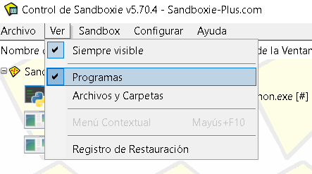
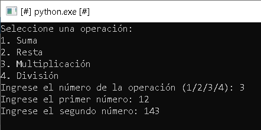

# PPS-Unidad1Actividad4-Angel

# Prueba de Aplicaciones en Entornos Controlados (Sandboxing)

Unidad 1 - Actividad 4.RA1. Prueba de aplicaciones en entorno controlado: Sandbox

## Descripción de la Actividad
En esta actividad, vamos a trabajar en la ejecución de aplicaciones dentro de entornos controlados, conocidos como **Sandboxes** o **cajas de arena**. Estos entornos permiten aislar la ejecución de un programa para evitar que afecte al sistema operativo o interactúe con recursos no autorizados, esto resulta muy útil a la hora de probar software, detectar vulnerabilidades y para aumentar la seguridad informática. 

El objetivo principal de esta actividad es ejecutar una aplicación **calculadora.py** dentro de un entorno seguro y controlado. 

A través de esta actividad comprobaremos qué ventajas ofrece y cómo podemos configurarla.

También, podemos encontrar más información sobre **sandboxing** en el siguiente artículo: [https://perception-point.io/hysolate-perceptionpoint-landing/](https://perception-point.io/hysolate-perceptionpoint-landing/)

## Objetivos
1. Busca cuáles son las distintas alternativas que tienes para probar esta aplicación en una Sandbox.
2. Crea el entorno controlado y prueba la aplicación en él.
3. Documenta cómo has desarrollado el proyecto en github.

---

## 1. Alternativas para Crear un Sandbox
Existen varias formas de crear entornos aislados para probar aplicaciones. Algunas opciones incluyen:

### **1. Máquinas Virtuales (VMs)**
- **Herramientas:** VirtualBox, VMware...
- **Ventajas:** Alto nivel de seguridad, posibilidad de restaurar snapshots.
- **Desventajas:** Alto consumo de recursos.

### **2. Contenedores (Docker)**
- **Herramientas:** Docker...
- **Descripción:** Aíslan la aplicación dentro de un contenedor sin necesidad de una VM completa.
- **Ventajas:** Ligero y rápido de desplegar.
- **Desventajas:** Comparte kernel con el host, menos aislamiento que una VM.

### **3. Entornos Virtuales de Lenguaje**
- **Ejemplos:** Python, Node.js...
- **Ventajas:** Fácil de usar, evita conflictos de versiones.
- **Desventajas:** No ofrece aislamiento del sistema operativo.

### **4. Plataformas de Sandboxing Especializadas**
- **Ejemplos:** Cuckoo Sandbox
- **Descripción:** Diseñadas para analizar el comportamiento de aplicaciones en un entorno seguro.
- **Ventajas:** Especializadas en análisis de seguridad.
- **Desventajas:** Pueden requerir conocimientos avanzados.

---

## 2. Creación del Entorno Controlado y Prueba de la Aplicación
Para la realización de esta actividad, usaremos **Sandboxie** como sandbox, ya que proporciona un entorno seguro y ligero para la ejecución de aplicaciones.

### **Pasos para Crear el Entorno Controlado en Sandboxie**

1. **Instalar Sandboxie**
Para instalar Sanboxie en el sistema, accedemos al siguiente enlace: [https://sandboxie-plus.com/downloads/](https://sandboxie-plus.com/downloads/)

Dentro de la sección "Sandboxie-Classic Downloads" seleccionamos la primera opción:

Tras la instalación se abrirá automáticamente la herramienta:

### **Pasos para probar la aplicación en Sandboxie**

1. **Ubicar el Código de la calculadora y Ejecutar la calculadora**

Accedemos a la ubicación donde se encuentre la calculadora, en mi caso la carpeta **Descargas**, hacemos clic derecho sobre la calculadora y comprobamos que aparece una opción que indica que podemos ejecutar la calculadora de manera aislada en una sandbox.

Al pulsar en **"Ejecutar Aislado en una Sandbox"** se abrirá un cmd con la calculadora, para abrir Sandboxie bastará abrir la aplicación **"Control de Sandboxie"**, pero antes debemos especificarle la ruta del programa con el que queremos abrir la calculadora, yo le indico **python**.

Dentro de **Sandboxie** en el menú superior al seleccionar la opción **Ver** observamos que podemos ver **Programas**, es decir, los programas que está ejecutando la herramienta Sandboxie.

También podemos visualizar **Archivos y Carpetas**, es decir, los archivos y carpetas a los que está accediendo y ejecutando la herramienta.

Por último, comprobamos que la calculadora funciona correctamente.

---

> Ángel Pérez Blanco
